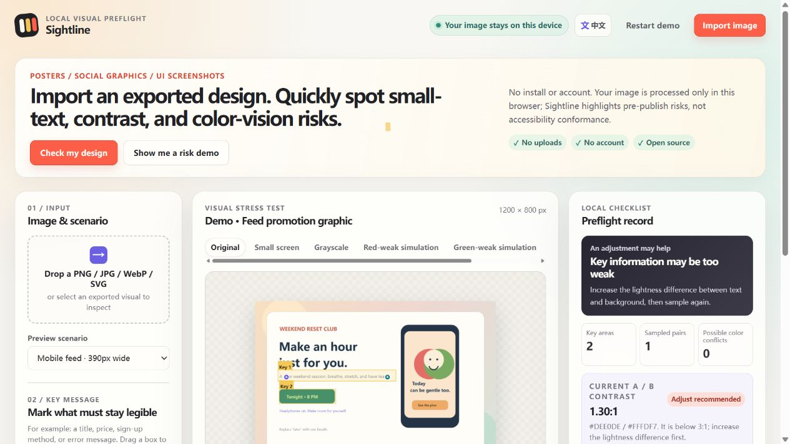

# Sightline — check whether a design stays readable before publishing

> A free, local-first readability checker for posters, social graphics, and UI screenshots. Quickly inspect small text, contrast, grayscale, and color-vision risks from the actual exported image.

[中文说明](./README.md)

  <a href="https://miffyli21.github.io/sightline-visual-preflight/?lang=en"><strong>Try Sightline now →</strong></a>
  ·
  <a href="https://miffyli21.github.io/sightline-visual-preflight/?lang=zh">中文体验</a>

<strong>No uploads · No account · No install</strong>

## What it helps you catch

- Small copy that disappears when a poster becomes a mobile-feed thumbnail;
- Status or emphasis that stops working in grayscale or color-vision simulations;
- Text over photos, gradients, or shadows whose sampled contrast is too weak;
- A title, price, button, or error message that deserves one more adjustment before delivery.

Sightline works from the final exported image, so you do not need a Figma source file. It does not replace an accessibility audit; it makes easy-to-miss visual risks visible earlier.

## Start in 30 seconds

1. [Open the hosted app](https://miffyli21.github.io/sightline-visual-preflight/?lang=en);
2. Explore the built-in risk demo or import your own PNG, JPG, WebP, GIF, or SVG;
3. Switch to small-screen, grayscale, or a color-vision view, then sample suspicious text and background pixels.

All image processing stays in the current browser. You can also download the repository and open `index.html` for fully local use.

If one step feels unclear, [leave a short feedback issue](https://github.com/miffyli21/sightline-visual-preflight/issues/new?template=feedback.md). No coding knowledge is required.

## What the current alpha does

- Imports PNG, JPG, WebP, GIF first frames, and SVG;
- Switches between original, small-screen, grayscale, red-weak, green-weak, and blue-weak views;
- Lets you mark a title, price, CTA, or other information that must remain legible;
- Samples two pixels to calculate the contrast of the actual color pair;
- Highlights dominant-color pairs that may converge in approximate color-vision simulations;
- Exports an annotated PNG view and a local JSON preflight record;
- Offers Chinese and English UI, including a bilingual demo image and guidance;
- Processes all image data in the current browser only.

## Try it or run it locally

The fastest route is the hosted demo: [open Sightline in English](https://miffyli21.github.io/sightline-visual-preflight/?lang=en).

To run it locally:

1. Download or clone this repository;
2. Open `index.html` in a browser, or double-click `打开 Sightline.bat` on Windows;
3. Select **Import image**.

There is no installation, account, server, or build step. Use the language button in the upper-right corner, or append `?lang=en` / `?lang=zh` to a hosted URL for a shareable language-specific link.

## The workflow

Most color tools expect you to know which two colors to inspect. Most color-vision simulators stop at a filtered preview. Sightline starts with the real exported artifact:

1. Drop in the graphic that is about to be published;
2. Mark the title, price, CTA, error message, or other information that must survive the viewing context;
3. Inspect those areas in small-screen, grayscale, and approximate color-vision views;
4. Sample suspicious text and background pixels to make a concrete contrast check;
5. Keep the local report as part of a design review or delivery record.

It is designed for people who may have only an exported image—not a Figma file, design system, or visual-regression pipeline.

## Boundaries that matter

- Contrast is calculated from the two pixels you sample. Gradients, transparency, shadows, photos, typography, and real devices all affect reading in practice.
- The color-vision views are approximate design-review simulations, not medical diagnostics.
- Sightline is not a WCAG, EAA, or other legal conformance certification tool.
- Public-facing products still need keyboard testing, screen-reader testing, real users, and professional audits where appropriate.

## Why open source and local-first

Design exports often contain client work, unreleased campaigns, or internal interfaces. Uploading them to an unfamiliar checking site can create a new risk. Sightline's default principle is simple: **keep the image on the device and keep the review logic inspectable.**

## Roadmap

### v0.1.0-alpha.2 · current

- [x] Local image import
- [x] Multiple visual stress-test views
- [x] Key-area marking
- [x] Two-pixel contrast checks
- [x] Dominant-color confusion-risk hints
- [x] PNG / JSON exports
- [x] Chinese and English UI

### Worth validating next

- [ ] Naming key areas and generating a human-readable delivery report;
- [ ] Local OCR to surface likely text areas;
- [ ] Saveable project files for team review;
- [ ] PDF page import and export;
- [ ] Explainability testing for color-confusion hints;
- [ ] Feedback from working designers and people with low vision or color-vision differences.

## Contributing and first-round validation

This is a static, dependency-free web project:

~~~text
index.html
styles.css
app.js
~~~

Edit the files and refresh the browser. Please read [CONTRIBUTING.en.md](./CONTRIBUTING.en.md) before opening a pull request. The Chinese version is [CONTRIBUTING.md](./CONTRIBUTING.md).

The repository includes three public test images and a five-minute tester script. Use only self-made, public, or permissioned material; do not post client or private visuals in public issues. English instructions: [validation/START_HERE.en.md](./validation/START_HERE.en.md). 中文说明：[validation/START_HERE.md](./validation/START_HERE.md).

## Alpha status

This is v0.1.0-alpha.2. The tool works, but its review logic, wording, and export format still need real workflow feedback. Please report misleading guidance, confusing steps, or privacy concerns. Do not treat a Sightline result as a formal accessibility conclusion.

## License

[MIT License](./LICENSE).

## Maintainer principle

Sightline must not turn a risk hint into a claim of compliance. If a calculation, label, or default suggestion is misleading, please open an issue with a public reproduction image or a detailed description.
